# Windows Detection Engineering Lab — Wazuh, Sysmon & MITRE ATT&CK

## Table of Contents

- [Overview](#overview)
- [Lab Architecture](#lab-architecture)
- [Lab Environment](#lab-environment)
- [Detection Coverage](#detection-coverage)
- [Validated Detections](#Validated-Detections)
  - [DET-001: PowerShell Encoded Command Execution](#det-001-powershell-encoded-command-execution)
  - [DET-002: Local User Account Creation](#det-002-local-user-account-creation)
  - [DET-003: Windows Service Creation / Modification](#det-003-windows-service-creation--modification)
  - [DET-009: EICAR Malware-Test File Detection](#det-009-eicar-malware-test-file-detection)
  - [DET-010: Atomic Red Team Framework Activity](#det-010-atomic-red-team-framework-activity)
- [MITRE&ATT&CK Evidence Screenshots](#MITRE-ATT&CK-Evidence-Screenshots)
- [Documentation](#Documentation)
- [Skills Demonstrated](#Skills-Demonstrated)
- [Lessons Learned](#Lessons-Learned)
- [Future Improvements](#Future-Improvements)
- [Security and Safety Notes](#Security-and-Safety-Notes)
- [Disclaimer](#disclaimer)

# Overview

This project extends my Enterprise SOC Lab by focusing on Windows detection engineering. It validates 5 custom Wazuh detections using Windows endpoint telemetry, Sysmon, Windows Security logs, Windows Defender events, and Atomic Red Team framework activity.

The goal of this project is to show how custom detection logic can be created, tested, mapped to MITRE ATT&CK, documented, and reviewed through Wazuh SIEM/XDR.

This is a controlled local lab project. No real malware, credential theft, ransomware, or unauthorized testing was performed.
---

# Lab Architecture

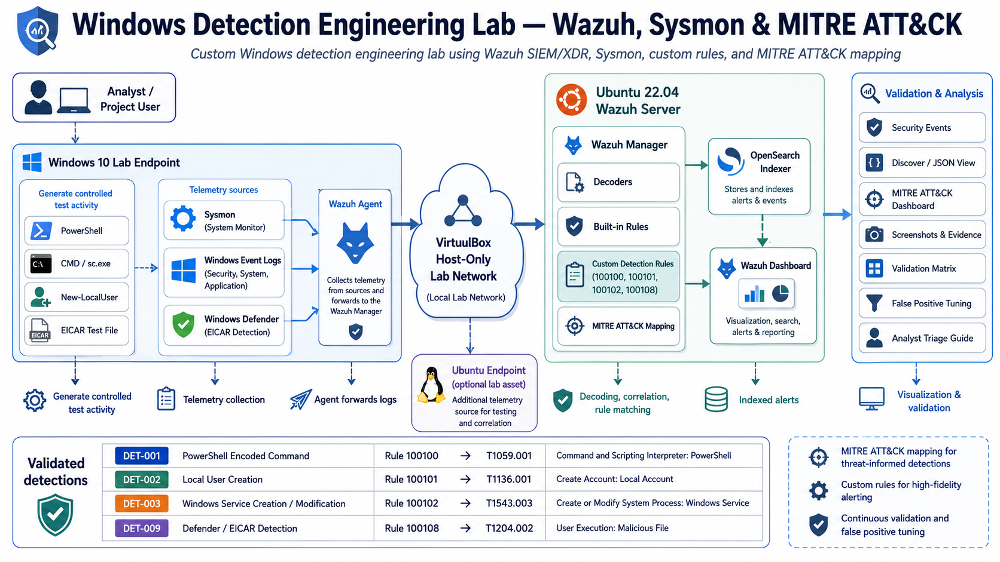

The lab is built using a controlled local virtual environment. Windows endpoint telemetry is collected through Sysmon, Windows Event Logs, and the Wazuh agent. Events are forwarded to the Wazuh manager, parsed, correlated, matched against built-in and custom rules, and then reviewed through the Wazuh Dashboard, Security Events, Discover/JSON view, and MITRE ATT&CK mapping.

---

# Lab Environment

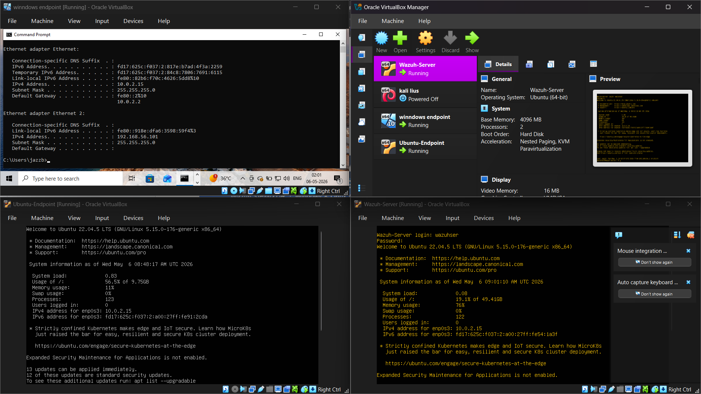

| Component | Technology |
|---|---|
| SIEM/XDR | Wazuh 4.7.5 |
| Endpoint | Windows 10 |
| Endpoint telemetry | Sysmon + Windows Event Logs |
| Additional endpoint | Ubuntu 22.04.5 |
| Virtualization | VirtualBox |
| Network | Host-only lab network |
| Detection mapping | MITRE ATT&CK |
| Evidence | Wazuh Dashboard, JSON alerts, screenshots |

---

## Project Goals

- Build custom Wazuh detection rules.
- Validate detections using controlled Windows activity.
- Map detections to MITRE ATT&CK techniques.
- Capture evidence from Wazuh alerts and JSON fields.
- Document test commands, false positives, triage steps, and rollback procedures.
- Present the project in a clean portfolio-ready GitHub format.

---

# Detection Coverage

| ID | Detection | Custom Rule | Log Source | MITRE ATT&CK |
|---|---|---|---|---|
| DET-001 | PowerShell encoded command execution | 100100 | Sysmon / Windows process telemetry | T1059.001 |
| DET-002 | Local user account creation | 100101 | Windows Security logs | T1136.001 |
| DET-003 | Windows service creation/modification | 100102 | Windows service / process telemetry | T1543.003 |
| DET-009 | EICAR malware-test file detection | 100108 | Windows Defender Operational | T1204.002 |
| DET-010 | Atomic Red Team framework activity | 100109 | Sysmon Event ID 1 | T1059.001 |

Note: Detection IDs reflect the original project numbering. DET-004 through DET-008 were removed during validation as they did not meet the evidence standard for this portfolio.

---

## Detection Engineering Workflow

1. Select a suspicious behavior and map it to MITRE ATT&CK.
2. Generate controlled telemetry on the Windows 10 lab VM.
3. Confirm the event is generated in Windows Event Viewer or Sysmon logs.
4. Confirm Wazuh receives and parses the event.
5. Identify relevant built-in Wazuh rules and event fields.
6. Create a custom Wazuh rule layer.
7. Restart and validate the Wazuh manager.
8. Re-run the test activity.
9. Confirm the custom rule fires in Wazuh Security Events.
10. Review the expanded JSON alert fields.
11. Capture screenshots as validation evidence.
12. Document false positives, tuning notes, and analyst triage steps.

---

# Validated Detections

 ## DET-001: PowerShell Encoded Command Execution

This detection identifies PowerShell encoded command execution activity, which can be used by attackers to obfuscate malicious commands and evade basic command-line review.

| Field | Value |
|---|---|
| Custom Rule | 100100 |
| MITRE Technique | T1059.001 |
| Tactic | Execution |
| Log Source | Sysmon / Windows Process Telemetry |
| Test Command | `powershell.exe -EncodedCommand` |
| Status | Detected |

Evidence:

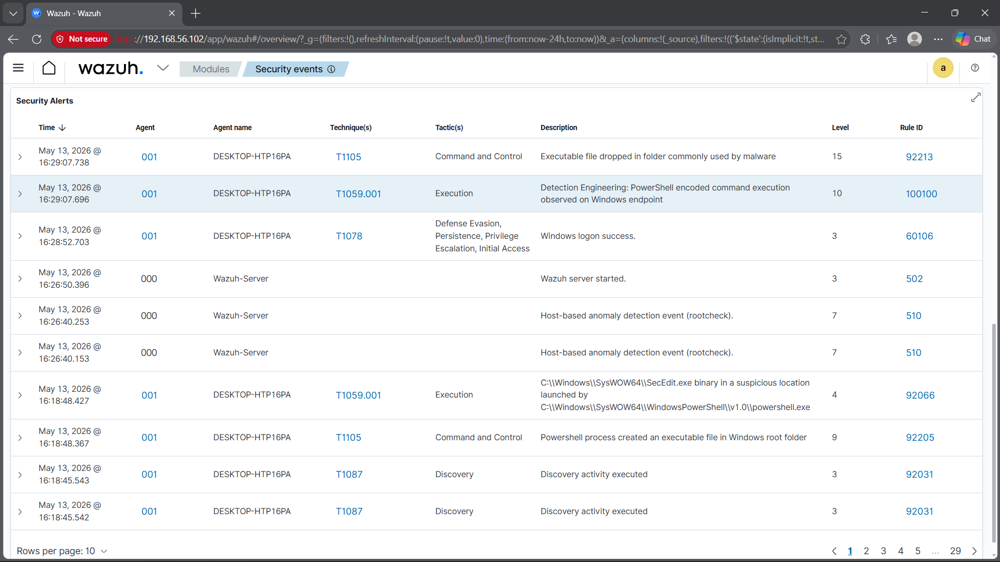

---

 ## DET-002: Local User Account Creation

This detection identifies local account creation activity, which can be used by attackers for persistence after gaining access to a system.

| Field | Value |
|---|---|
| Custom Rule | 100101 |
| MITRE Technique | T1136.001 |
| Tactic | Persistence |
| Log Source | Windows Security Log |
| Test Command | `New-LocalUser` |
| Status | Detected |

Evidence:

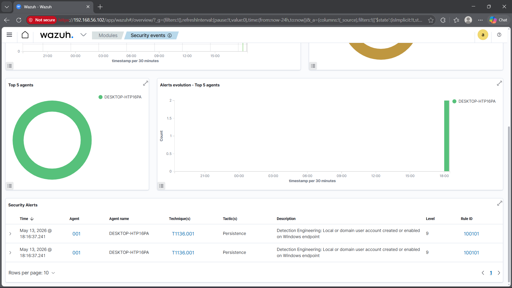

---

 ## DET-003: Windows Service Creation / Modification

This detection identifies Windows service creation or modification activity, which can be abused for persistence or privilege escalation.

| Field | Value |
|---|---|
| Custom Rule | 100102 |
| MITRE Technique | T1543.003 |
| Tactic | Persistence / Privilege Escalation |
| Log Source | Sysmon / Windows Event Logs |
| Test Command | `sc.exe create` |
| Status | Detected |

Evidence:

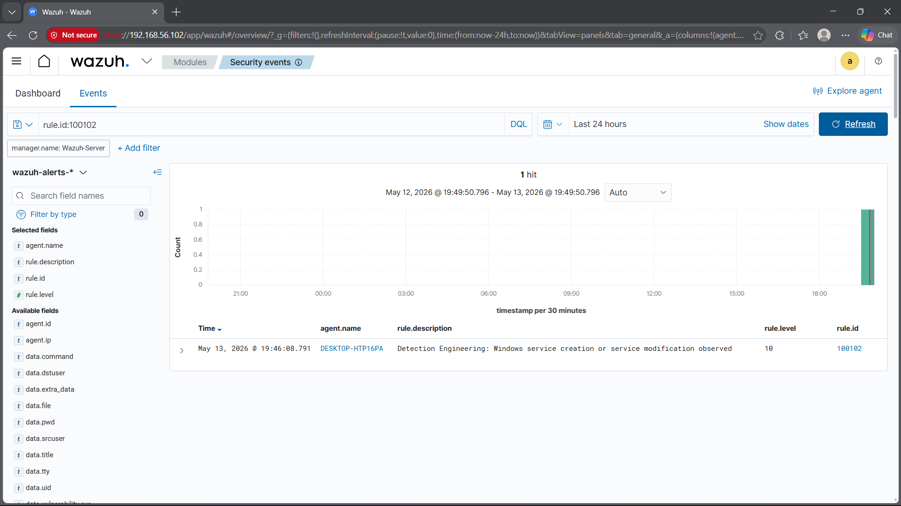

---

 ## DET-009: Windows Defender Malware-Test Detection

This detection identifies Windows Defender malware-test telemetry generated from a safe EICAR test file. It demonstrates custom rule chaining from built-in Wazuh Defender detections.

| Field | Value |
|---|---|
| Custom Rule | 100108 |
| MITRE Technique | T1204.002 |
| Tactic | User Execution |
| Log Source | Windows Defender Operational Logs |
| Test Method | EICAR test file |
| Status | Detected |

Evidence:

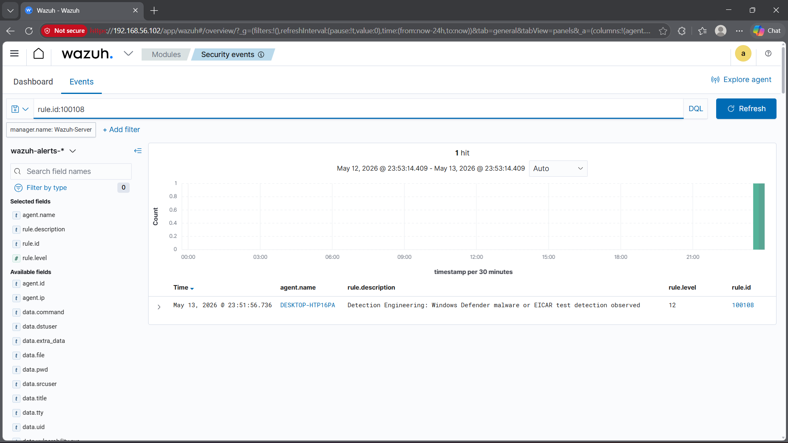

---

## DET-010: Atomic Red Team Framework Activity

This detection identifies Atomic Red Team framework activity, which is commonly used for controlled adversary emulation and MITRE ATT&CK-based detection validation. In an enterprise environment, unexpected Atomic Red Team execution may indicate unauthorized security testing or suspicious PowerShell-based activity.

| Field | Value |
|---|---|
| Custom Rule | 100109 |
| MITRE Technique | T1059.001 |
| Tactic | Execution |
| Log Source | Sysmon Event ID 1 |
| Test Command | `Invoke-AtomicTest T1059.001 -ShowDetailsBrief` |
| Status | Detected |

Evidence:

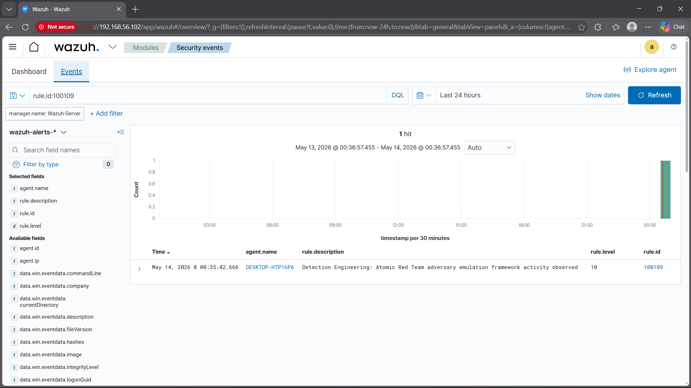

---

# MITRE ATT&CK Evidence Screenshots

## MITRE&ATT&CK Dashboard

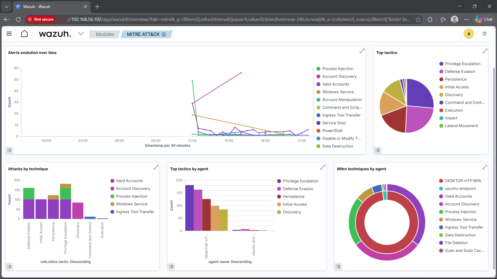

| Detection | Evidence |
|---|---|
| DET-001 PowerShell encoded command | 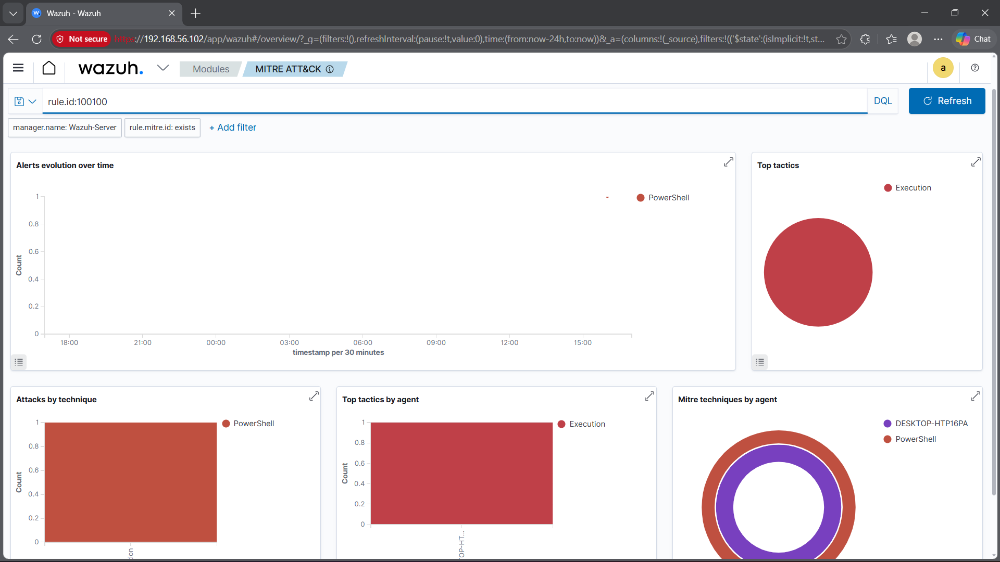 |
| DET-002 Local user account creation | 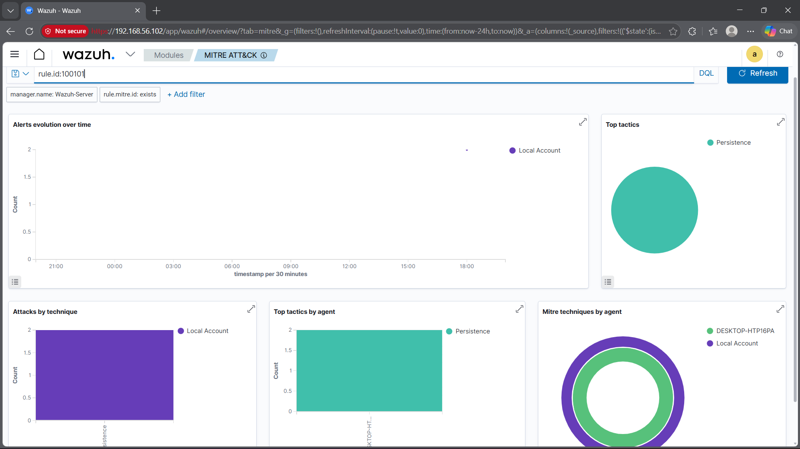 |
| DET-003 Windows service creation/modification | 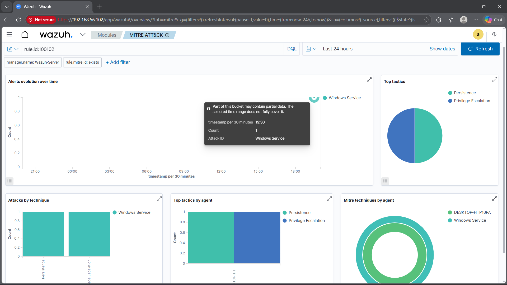 |
| DET-009 EICAR malware-test detection | 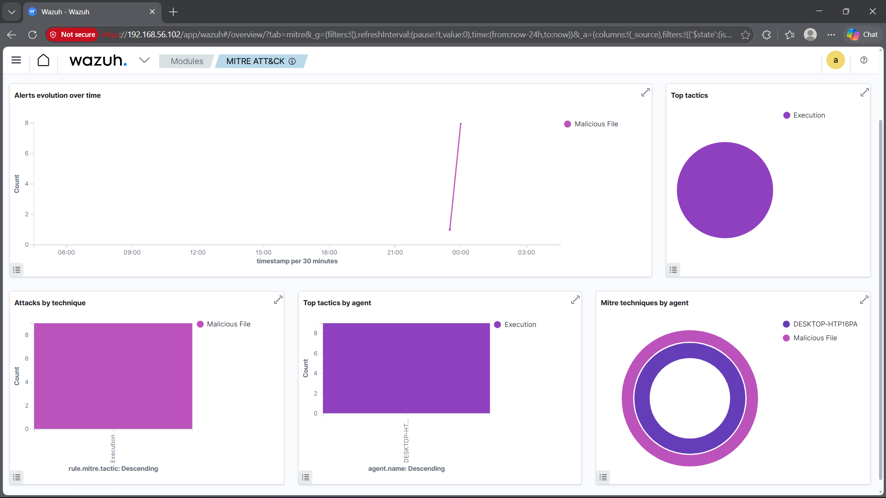 |
| DET-010 Atomic Red Team framework activity | 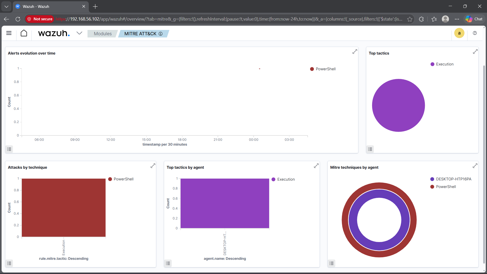 |
---

# Documentation

| Document | Purpose |
|---|---|
| [Detection Notes](docs/Detection-Notes.pdf) | Explains project objective, workflow, implemented detections, and lessons learned |
| [Analyst Triage Guide](docs/Analyst-Triage-Guide.pdf) | Provides SOC-style triage questions and steps for each detection |
| [Rollback Plan](docs/Rollback-Plan.pdf) | Documents how to safely remove or rollback custom Wazuh rules |
| [Validation Matrix](validation/Validation-Matrix.pdf) | Maps detections to commands, rules, MITRE techniques, status, and evidence |
| [Test Commands](validation/Test-Commands.pdf) | Lists the controlled commands used to generate telemetry |
| [False Positive Tuning Notes](validation/False-Positive-Tuning-Notes.pdf) | Documents possible false positives and tuning considerations |

---

# Skills Demonstrated

- Wazuh SIEM/XDR rule creation
- Windows endpoint detection engineering
- Sysmon telemetry analysis
- Windows Security event review
- Windows Defender event monitoring
- Atomic Red Team validation
- MITRE ATT&CK mapping
- Alert triage documentation
- False-positive tuning
- Evidence redaction and safe lab documentation
---

## Lessons Learned

- Detection engineering requires more than writing rules; each detection needs testing, validation, evidence, and documentation.

- Sysmon, Windows Security logs, and Windows Defender logs provide valuable Windows endpoint visibility inside Wazuh.

- MITRE ATT&CK mapping helps connect raw alerts to real adversary techniques.

- Safe tools like EICAR and Atomic Red Team can validate detections without using real malware.

- False-positive tuning and analyst triage notes make detections more practical for SOC workflows.

- A small set of fully validated detections is stronger than a large list of unproven detections.

---

# Future Improvements

Future improvements will focus on expanding the project only with detections that are fully validated and evidence-backed. Planned enhancements include adding more Windows persistence and privilege-related detections, creating Sigma rule equivalents, adding `wazuh-logtest` validation output, improving sanitized JSON evidence, building a MITRE ATT&CK coverage map, and documenting severity rationale for each detection. The lab can also be expanded with Active Directory telemetry to support more realistic enterprise-style detections such as authentication attacks, group membership changes, and domain-level account activity.

---

# Security and Safety Notes

This project was built in a controlled local lab environment for cybersecurity learning and portfolio demonstration.

The commands and test activities were executed only on authorized lab systems. The EICAR test file is a safe industry-standard malware test string used to validate antivirus and detection workflows.

No real production systems were targeted.

---

## Disclaimer

This repository is for educational and defensive cybersecurity purposes only. The detection logic, screenshots, and validation steps are intended to demonstrate blue-team engineering skills, SOC investigation practices, and safe SIEM rule development.
